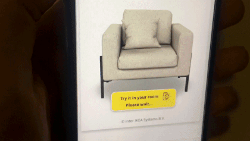

# Designhubz | React-Native Widget

This project highlights the usage of the Designhubz react-native package for Spatial XR.



---

## Using the module

### 1. Add dependencies as shown [in package.json](./package.json#13):
  ``` json
    "dependencies": {
      "designhubz-react-native": "https://designhubz-react-native.s3.ap-south-1.amazonaws.com/designhubz-react-native-1.2.3.tgz",
      "react-native-file-viewer": "https://designhubz-react-native.s3.ap-south-1.amazonaws.com/react-native-file-viewer-2.2.1.tgz",
      "react-native-fs": "^2.20.0",
      "react-native-webview": "^11.18.2"
    }
  ```
> `designhubz-react-native` is our main module, but the rest are added as a workaround to react-native not auto-linking nested dependencies.

<br>

### 2. Import and display the SpatialXRWidget component:
``` js
import { SpatialXRWidget } from 'designhubz-react-native';
```
``` html
<SpatialXRWidget
  style={{flex: 1}}
  apiKey={apiKey}
  productID={productID}
  theme={theme}
/>
```
---

## Running the example

1. Clone project and open terminal in root project folder
2. Install and run:
```bash
# install
yarn

# run (yarn android/ios)
yarn start
```

---

## Changelog

### 1.2.3
- Add onARLoaded injected javascript function

### 1.2.2
- Support React Native version 0.70.+

### 1.2.1
- Expose share button click handler
- Add native share example

### 1.2.0
- Fix AR launcher for Android 11+ (w/ react-native-file-viewer-2.2.1)

### 1.1.5
- Add onError handler
- Improve direct AR
- Bug fixes and performance improvements

### 1.1.1
- Bug fixes
- Expose AR only option with `directAR` prop

### 1.0.0 First release
